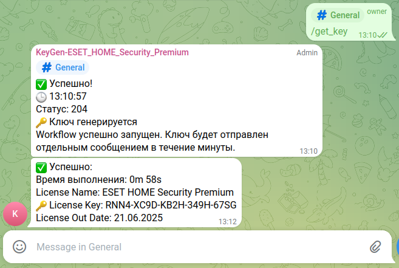

# Дополнение к KeyGen — ESET HOME Security Premium для Linux

Каталог `customizations/` предназначен для хранения дополнений и утилит, связанных с основным проектом.

---

## 📂 Скрипт `run_telegram_github_action.py`

Асинхронный Telegram-бот для автоматического запуска workflow в GitHub Actions и выдачи пользователям триальных 30-дневных ключей в Telegram-группе KeyGen-ESET_HOME_Security_Premium.

---

### 📌 Краткое описание работы скрипта:

* Подключается к Telegram группе через Bot API и принимает команды от пользователей.
* Поддерживает единственную команду — `/get_key`, которая запускает указанный workflow в GitHub Actions.
* Для запуска workflow использует GitHub-токен, а для Telegram — токен бота. Оба токена загружаются из файла `.env`. Пример — в `.env_example`.
* Ведёт подробное логирование в консоль и файл, с фильтрацией чувствительных данных.
* Ограничивает частоту запросов пользователей с помощью `RateLimiter`, предотвращая спам.
* Обрабатывает ошибки GitHub API и Telegram и сообщает о них пользователю.
* Приветствует новых участников и реагирует на неизвестные команды.

---

---
## 🔧 Установка виртуального окружения и запуск скрипта

### 1. Установка [**uv**]
Для запуска python скрипта используется утилита `uv`. [Офф. инструкция](https://docs.astral.sh/uv/getting-started/installation/) `install uv`.

#### macOS / Linux:

```bash
curl -LsSf https://astral.sh/uv/install.sh | sh
```

#### pip:

```bash
pip install uv
```

---

### 2. Подготовка окружения

Перейдите в каталог:

```bash
cd customizations
```

Синхронизация зависимостей и создание окружения:

```bash
uv sync
```

---

### 3. Проверка зависимостей:

```bash
uv pip list
```

---

### 4. Запуск скрипта:

```bash
uv run python run_telegram_github_action.py
```

---

## ⚛️ Автозапуск через systemd

### 1. Обновите pip внутри виртуального окружения:

```bash
sudo -u $USER /home/$USER/Work/KeyGen-ESET_HOME_Security_Premium/customizations/.venv/bin/python -m ensurepip --upgrade
```
### Проверьте результат:
```bash
sudo -u $USER /home/$USER/Work/KeyGen-ESET_HOME_Security_Premium/customizations/.venv/bin/python -m pip list
```
Вы должны увидеть список пакетов.

### Првоерка запуска скрипта:
sudo -u $USER /home/$USER/Work/KeyGen-ESET_HOME_Security_Premium/customizations/.venv/bin/python /home/$USER/Work/KeyGen-ESET_HOME_Security_Premium/customizations/run_telegram_github_action.py

### 2. Создание unit-файла:

```bash
sudo nano /etc/systemd/system/telegram_github_action.service
```

### Пример unit-файла:

```ini
[Unit]
Description=Telegram GitHub Action Bot
After=network.target

[Service]
Type=simple
User=user
WorkingDirectory=/home/user/Work/KeyGen-ESET_HOME_Security_Premium/customizations

ExecStart=/home/user/Work/KeyGen-ESET_HOME_Security_Premium/customizations/.venv/bin/python /home/user/Work/KeyGen-ESET_HOME_Security_Premium/customizations/run_telegram_github_action.py

Restart=always
RestartSec=5
Environment=PATH=/home/user/.local/bin:/usr/local/sbin:/usr/local/bin:/usr/sbin:/usr/bin:/sbin:/bin
Environment=PYTHONUNBUFFERED=1

[Install]
WantedBy=multi-user.target
```

### 3. Активация и запуск:

```bash
sudo systemctl daemon-reexec
sudo systemctl daemon-reload
sudo systemctl enable telegram_github_action.service
sudo systemctl start telegram_github_action.service
```

### 4. Проверка:

```bash
systemctl status telegram_github_action.service
journalctl -u telegram_github_action.service -f
```

---
# Дополнение. Автоматическая проверка кода перед коммитом в github
## ✅ Pre-commit проверки

[Pre-commit](https://pre-commit.com/) — инструмент для автоматического запуска проверок перед git commit.

### Установка:

```bash
pip3 install pre-commit
```

### Настройка:

```bash
pre-commit install
```

### Ручная проверка:

```bash
pre-commit run --all-files
```

---
